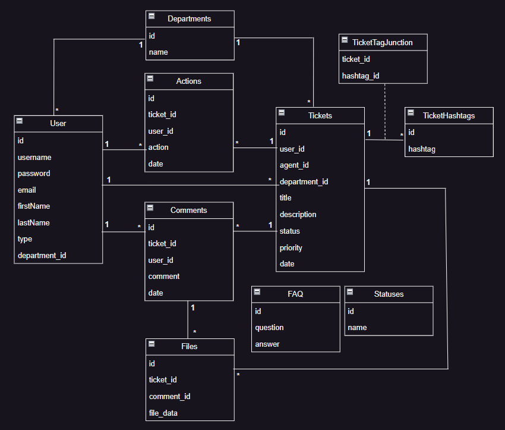

# LTW Project

## Project Description
Develop a website to streamline and manage trouble tickets effectively.

This project was done by:
- *Eduardo Oliveira*, up202108690
- *João Padrão*, up202108766
- *Luís Jesus*, up202108683

---
## Index
1. [Credentials](#credentials)
1. [Mockups](#Mockups)
1. [UML](#UML)
1. [Code Practices](#Code-Practices)
1. [Features](#Features)

---
### Accounts for login (email/password (role))

- client@gmail.com / client123 (User)
- agent@gmail.com / agent123 (Agent)
- admin@gmail.com / admin123 (Admin)

---
### Libraries

#### Google Fonts
```html
<link href="https://fonts.googleapis.com/css2?family=Montserrat&display=swap" rel="stylesheet">
```

Font used in text throughout the website.

#### Icons
```html
<link href="https://fonts.googleapis.com/css2?family=Material+Symbols+Outlined" rel="stylesheet">
```

Font used for the icons that appear on the various pages throughout the website.

---
### Mockups

| Login | Register |
| --- | --- |
|  |  |

| Profile | FAQ |
| --- | --- |
|  |  |


|Tickets | Ticket Information |
| --- | --- |
|  |  |


|About Us | Management |
| --- | --- |
|  |  |

---

### Final Aspect


### UML



---
### Code practices

- All the content should be in english
- Git Flow followed (dont commit directly on master, use pull requests, ...)

---
### Features

#### Required Features
All users should be able to:
- [x] Register a new account.
- [x] Login and logout.
- [x] Edit their profile (at least name, username, password, and e-mail).

Clients should be able to:
- [x] Submit a new ticket optionally choosing a department (e.g., "Accounting").
- [x] List and track tickets they have submitted.
- [x] Reply to inquiries (e.g., the agent asks for more details) about their tickets and add more information to already submitted tickets.

Agents should be able to(they are also clients):
- [x] List tickets from their departments (e.g., "Accounting"), and filter them in different ways (e.g., by date, by assigned agent, by status, by priority, by hashtag).
- [x] Change the department of a ticket (e.g., the client chose the wrong department).
- [x] Assign a ticket to themselves or someone else.
- [x] Change the status of a ticket. Tickets can have many statuses (e.g., open, assigned, closed); some may change automatically (e.g., ticket changes to "assigned" after being assigned to an agent).
- [x] Edit ticket hashtags easily (just type hashtag to add (with autocomplete), and click to remove).
- [x] List all changes done to a ticket (e.g., status changes, assignments, edits).
- [x] Manage the FAQ and use an answer from the FAQ to answer a ticket.

Admins should be able to(they are also agents):
- [x] Upgrade a client to an agent or an admin.
- [x] Add new departments, statuses, and other relevant entities.
- [x] Assign agents to departments.
- [x] Control the whole system.


#### Extra Features

- [x] Tickets can have documents attached to them.
- [x] Agents can see a client's history and clients can see yours.


#### Security Features

- [x] Hashed passwords
- [x] XSS attacks prevented
- [x] SQL using prepare/execute (preventing SQL injection)


### Technologies
- [x] Correct usage of HTML
- [x] CSS
- [x] Responsive CSS
- [x] Javascript
- [x] Ajax
     
### Usability:
- [x] Error messages
- [x] Dark mode
